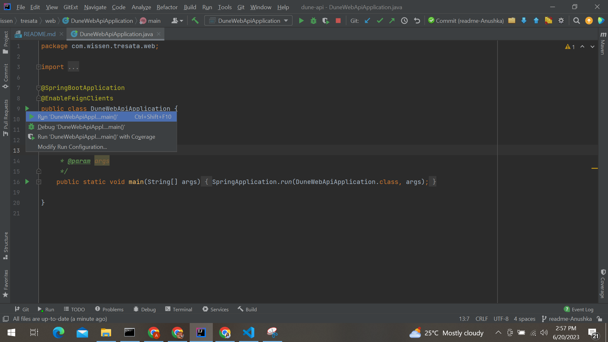

#Getting started Spring boot Maven project

The project is a Spring boot maven project.

We can find the codebase on github and link for the same is:
https://github.com/tresata/dune-api/tree/development

Branches: 

    -> development
    -> main

### **Steps to setup the code:**
1. Clone the git repository from https://github.com/tresata/dune-api/tree/development to a desired folder.
    

    git clone https://github.com/tresata/dune-api.git

2. Open the cloned repo in intellij.

### **Steps to run the code in IntelliJ :**
1. Edit the configuration of the project and add the following config:

   
   
2. After adding the config, click OK.

3. Go to **DuneWebApiApplication.java** and run it.

### **Sonar Qube Report** -:
1. Download SonarQube: Go to the SonarQube website (https://www.sonarqube.org/downloads/) and download the latest version of SonarQube that is compatible with your system. 

2. Start SonarQube Server: Open a terminal or command prompt, navigate to the extracted SonarQube directory, and run the following command:
    
        bin\windows-x86-64\StartSonar.bat
   
   
3. To generate the Sonar Report, run the following command:
        
        mvn sonar:sonar
   
            
4.  Report of Sonar Qube will be available on this url:
    
        http://localhost:9000/dashboard?id=com.wissen%3Adune-web-api

   
### **Check Style** -:
1. To see if your code passes the checkStyle check, run the following code:
   
        mvn checkstyle:check

2. Check if the build passes.

   

### **Sure Fire Report** -:
1. Run the following to generate Sure Fire test reports:
   
        mvn clean test

2. Check if the build passes.

3. To find the Sure Fire reports, go the following location:
   
        dune-api/target/site/jacoco/index.html
4. Open the html file in browser and you can see the Sure Fire report.

### **APIs** -:

#### _Notes_:
| Operation | Endpoints |  Description   |
| :---: | :---:   | :---: |
| GET | http://localhost:8081/api/note  | API to get the notes. |
| GET | http://localhost:8081/api/note/count | API to get the count of the notes. |
| GET | http://localhost:8081/api/note/1 | API to get the notes by id. |
| POST | http://localhost:8081/api/note | API to post the notes. |
| PUT | http://localhost:8081/api/note/1 | API to update the notes for a given id. |
| DELETE | http://localhost:8081/api/note/1 | API to delete the notes for a given id. |

#### _Favorites_:
| Operation | Endpoints |  Description   |
| :---: | :---:   | :---: |
| POST | http://localhost:8081/api/favorite/markFavorite?filePath=s3a://tresdev-theone/user/george/compression_stats.csv&status=true | API to mark the filpath as favorite or unfavorite. |
| GET | http://localhost:8081/api/favorite/getAllFavorite | API to get all the favorite filepaths. |

#### _Sourcing_:

| Operation | Endpoints |  Description   |
| :---: | :---:   | :---: |
| GET | http://localhost:8081/ls?path=s3a://tresdev-theone/user | API to list out the files and directories. |
| GET | http://localhost:8081/ls/schema?path=s3a://tresdev-theone/user/george/compression_stats.csv&format=csv | API to get the schema for the filepath in the provided format.
| GET | http://localhost:8081/ls/data?path=s3a://tresdev-theone/user/george/compression_stats.csv&format=csv&count=5 | API to list out the n number of lines of data for the filepath in the provided format.

### **Steps to get these APIs working on your local:**
1. Make sure that you are connected to the OpenVPN before proceeding.
2. Start the AWS CLI:

    
    1. Open the ‘CMD’ and run command: aws configure sso
        
    2. Put ‘SSO session name (Recommended)’ as tresdev.
    
    3. After this it will redirect to the browser, where after some processing you will be prompted to login with google. Login with Trsata’s email.
    
    4. It will redirect to the AWS page, where it will ask ‘Allow botocore-client-tresdev to access your data?’. Click allow.
    
    5. Return to the cmd. And select ‘tresdev’.
    
    6. Put details as given below:
        a. CLI default client Region [None]: {Press Enter}
        b. CLI default output format [None]: {Press Enter}
        c. CLI profile name [tresdev-xxxxxxxxxxxx]: tresdev

3. To get the JWT token:

    1. Download the python script file ‘token.py’ from Github https://github.com/tresata/dune-api, from utils package.
    
    2. Open command prompt in the folder where the ‘token.py’ file is and run command ‘python token.py username password’. 
    
    3. In return you will receive a JWT token, which will be valid for 1 hour.
    
4. Run this command to connect with OpenSearch: 
    
   
    kubectl port-forward -n opensearch service/opensearch-default 9200

5. Run this command to connect with Dune API:
   
    
    kubectl port-forward -n theone service/tresata-dune-data-api 9091:8080

6. To run the wrapper APIs, provide the JWT token in Authorization header and hit the API. You would see the result now.
   
Here is the result of wrapper /ls API after providing the JWT token in the header :

   